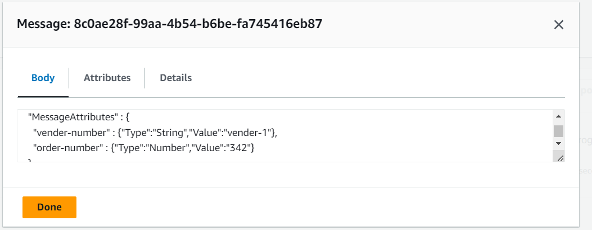

# SNS-SQS-

i made a SNS to tell the driver that he have new orders, and the messages will go to SQS

the SQS receved the message

i made a nother SQS for vender-1

and i send another message to the vender-1 and the driver

